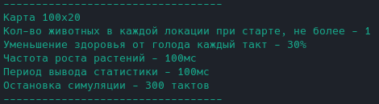
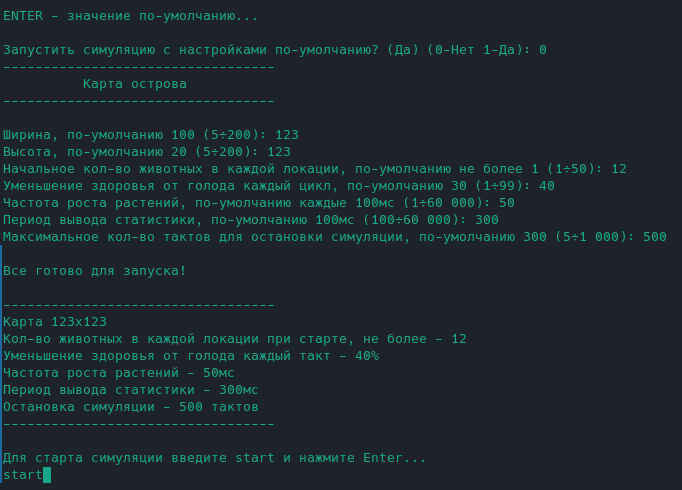
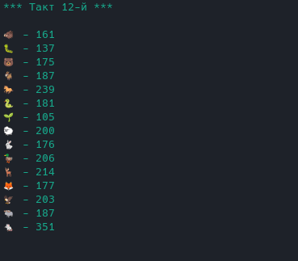
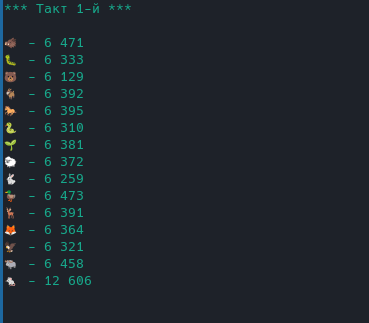

# Island Life Simulator

## Краткое описание

Симулятор жизненного цикла острова, состоящего из локаций, которые заполнены растительностью и животными.

Животные могут:
* есть растения и/или других животных (если в их локации есть подходящая еда),
* передвигаться (в соседние локации),
* размножаться (при наличии пары в их локации),
* спать,
* умирать от голода или быть съеденными.

## Описание работы

Перед запуском симуляции предлагается либо стартовать с дефолтными настройками, либо установить их вручную.

Настройки по-умолчанию:

Вариант установки параметров вручную:

## Ограничения

* Граничные значения параметров при вводе вручную прописаны в скобках после наименования.
* Очистка консоли при обновлении статистики по острову корректно работает в отдельном терминале и не работает в Intellij Idea
* Для корректного отображения в статистике `emoji` типов сущностей может потребоваться установить доп. зависимости.
* Надо учитывать что код приложения написан с использованием `java 17`

## Краткое описание классов

Пакет `simulation` содержит классы
* `SimulationSettings` - содержит основные константы и изменяемые параметры приложения
* `SimulationStarter` - обеспечивает запуск симуляции в разных потоках

Пакет `dialog` содержит классы
* `DialogText` - содержит строковые константы для диалога с пользователем
* `UserDialog` - описывает диалог с пользователем

Пакет `island` содержит классы
* `IslandController` - обеспечивает управление картой острова
* `IslandMap` - описывает карту острова
* `IslandStats` - собирает и печатает статистику по острову
* `Location` - описывает локацию острова

Пакет `entities` содержит классы
* `EatingMap` - управляет питанием животных
* `Entity` - абстрактный класс сущности
* `EntityFactory` - фабрика сущностей
* `EntityType` - перечисление типов сущностей 
* пакет `animals`
* пакет `plants`

Пакет `animals` содержит классы
* `Action` - перечисление действий
* `Animal` - описывает общие свойства животных
* `Direction` - перечисление направлений движения
* пакет `herbivores` - содержит конкретные классы плотоядных животных
* пакет `predators` - содержит конкретные классы хищников

Пакет `plants` содержит конкретный класс растения

Класс `Main` - точка входа в программу 

## Запуск

Исполняемый файл находится в каталоге `dist`

При запуске исполняемого `.jar`-файла корректная работа не гарантируется при установленной в системе версии `jdk` ниже 17  
Проверить версию можно коммандой `java -version` и `javac -version`

Вводим команду из каталога с файлом либо прописываем путь к файлу перед именем

    java -jar <имя_исполняемого_файла>.jar  

## Примеры

Примеры вывода статистики с разными параметрами

